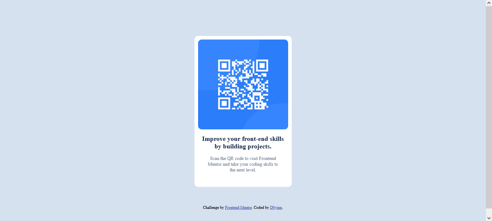

# Frontend Mentor - QR code component solution

This is a solution to the [QR code component challenge on Frontend Mentor](https://www.frontendmentor.io/challenges/qr-code-component-iux_sIO_H). Frontend Mentor challenges help you improve your coding skills by building realistic projects. 

## Table of contents

- [Overview](#overview)
  - [Screenshot](#screenshot)
  - [Links](#links)
- [My process](#my-process)
  - [Built with](#built-with)
  - [What I learned](#what-i-learned)
  - [Continued development](#continued-development)
  - [Useful resources](#useful-resources)
- [Author](#author)
- [Acknowledgments](#acknowledgments)


## Overview
This is a Qr-code project built with just HTML & CSS. I started structing with HTML, applying some semantic elements, then proceed to CSS for styling. Several styling properties were used  and details are provided below.

### Screenshot





### Links

- Solution URL: [Add solution URL here](https://your-solution-url.com)
- Live Site URL: [Add live site URL here](https://your-live-site-url.com)

## My process
I used HTML semantic elements like main and div for proper structuring amd I used some CSS styling properties like Flex-box, positioning and media query for the styling.

### Built with

- Semantic HTML5 markup
- CSS custom properties
- Flexbox
- Mobile-first workflow


### What I learned

I have learned how to use positioning styling properties properly on this project and also my responsiveness is improving has I had to check out some documentation on MDN web docs to help me. Although, the responsiveness for this project doesn't require too much work.
I also discovered that I don't always have to use a lot of div in my work as there are other semantic elements that one can explore. 


```html
Some HTML code I'm proud of
<main>
    <div class="wrapper">
      
     
      <h1> Improve your front-end skills by building projects.</h1>
      <p>Scan the QR code to visit Frontend Mentor and take your coding skills to the next level.</p>
    </div>
  </main>
```
```css
.wrapper {
    background-color: #ffffff; /* White background for the box */
    width: 250px; 
    height: 400px;
    margin-top: 100px;
    margin-left: 40%;
    margin-right: 40%;
    padding: 10px; /* Spacing inside the box */
    border-radius: 10px;
    text-align: center;
    position: relative;
} 
```

### Continued development

I want to continue focusing my design responsiveness. I want to improve on mobile-first webflow and perfect my responsiveess for all screen type. I also want to explore more stylig properties for proper placements and positioning.


### Useful resources

- [Resource 1](https://developer.mozilla.org/en-US/docs/Learn/CSS/CSS_layout/Positioning) - This helped me with the positioning of the qr-code image and texts on the same white background and it also helped me realize that I have to use some other styling properties like top, bottom, left and right properties in order to get the desired result when using the "Position: relative" properties. I will play around with more styling properties and see how they can help me improve my CSS knowledge.
- [Resource 2](https://developer.mozilla.org/en-US/docs/Learn/CSS/CSS_layout/Responsive_Design) - This helped me with styling for my responsiveness. I'd recommend it to anyone still learning this concept.


## Author

- Website - [Add your name here](https://www.your-site.com)
- Frontend Mentor - [@D0yinn](https://www.frontendmentor.io/profile/D0yinn)
- Twitter - [@D0yinn](https://www.twitter.com/D0yinn)


## Acknowledgments

Thanks to my LITA community for help me get clarity on some confusing concepts like the responsiveness of my design. I know I have mentioned the responsiveness quite a number of time but I am really finding it challenging at the moment but I working on getting better.


